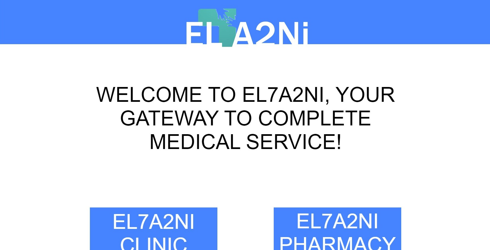
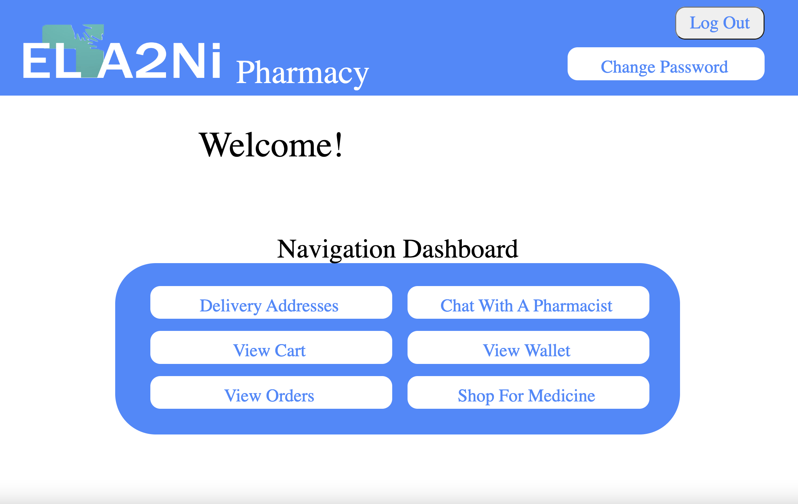
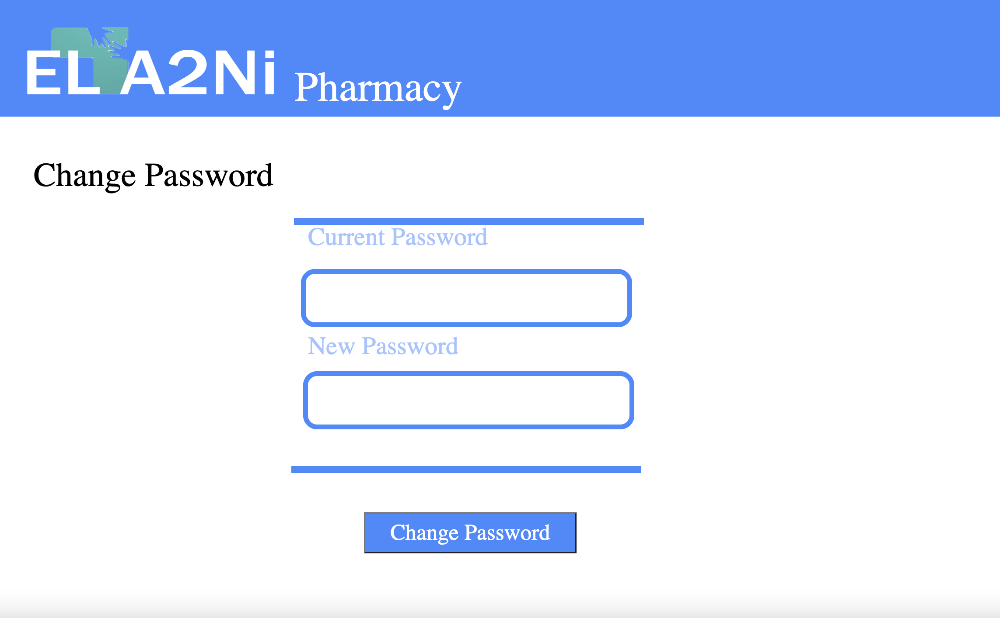
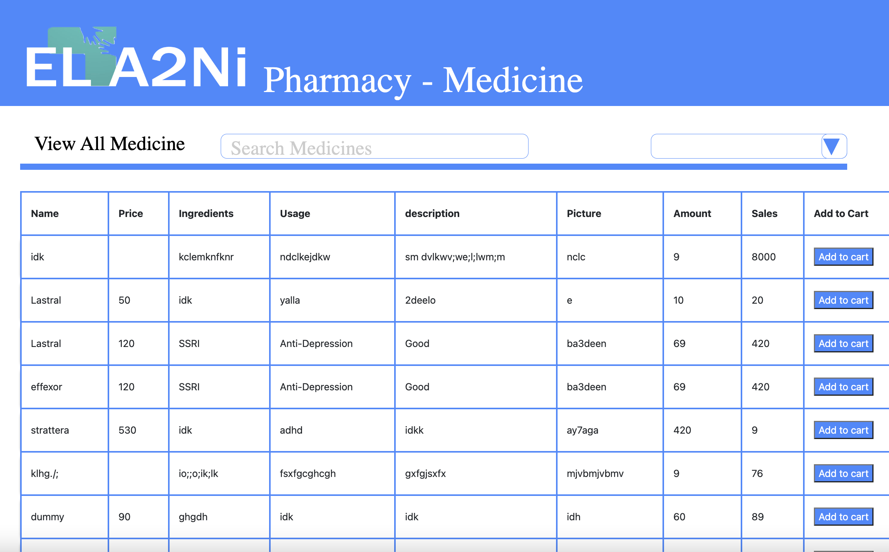
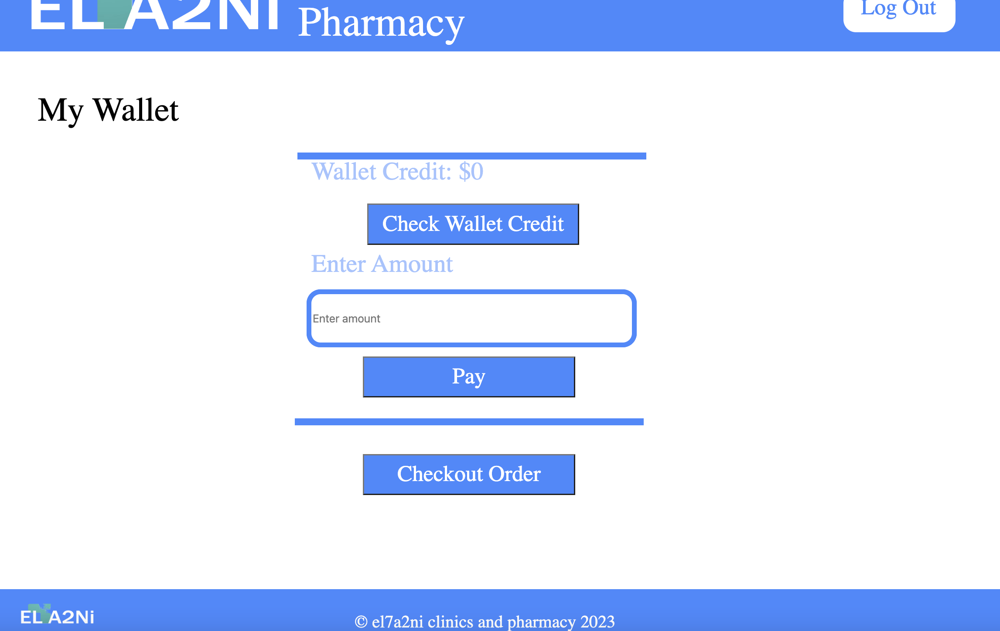
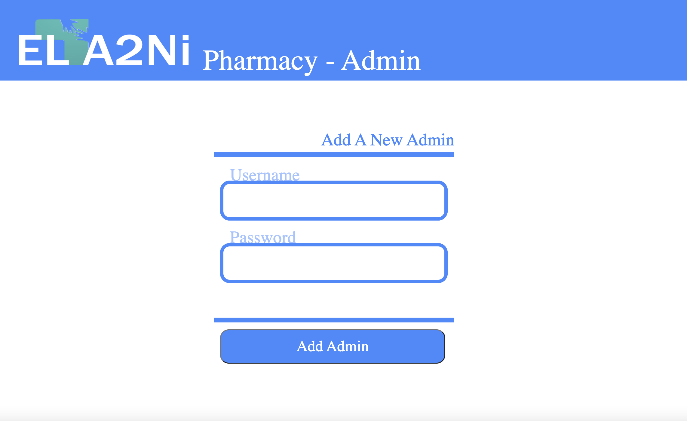
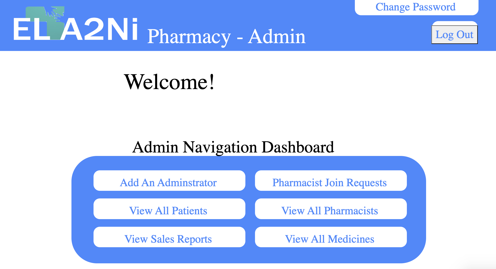
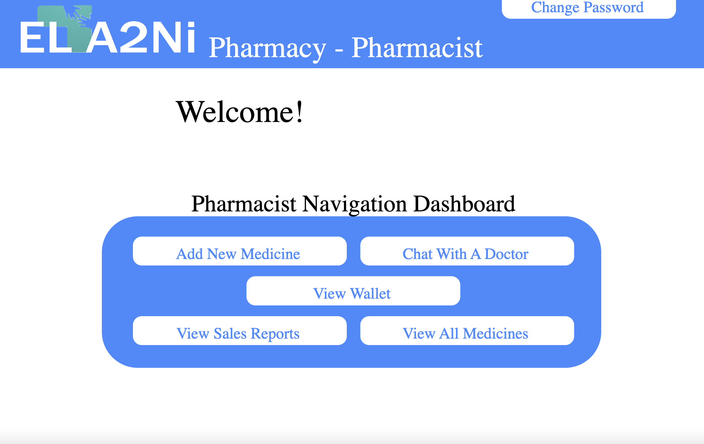
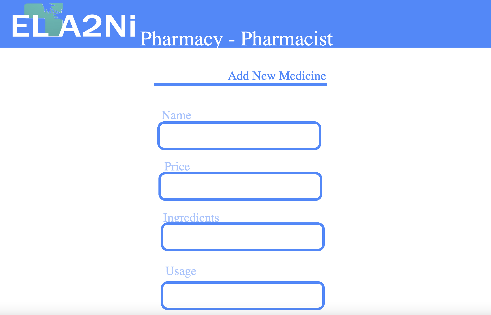

# THE MATRIX TEAM

# Advanced Computer Lab Project

# EL7A2NI PHARMACI

> This website is an integrated online medical servide consisting of a El7a2ni Pharmacy and El7a2ni Clinic. The application is built using the `MERN` stack.

<!-- TABLE OF CONTENTS -->
<details>
  <summary>Table of Contents</summary>
  <ol>
    <li><a href="#Motivation">Motivation</a></li>
    <li><a href="#Build-status">Build Status</a></li>
    <li><a href="#Code-style">Code Style</a></li>
    <li><a href="#Code-Examples">Code Examples</a></li>
    <li><a href="#screenshots">Screenshots</a></li>
    <li><a href="#Tech-used">Tech/Framework used</a></li>
    <li><a href="#Features">Features</a></li>
    <li><a href="#API-References">API References</a></li>
    <li><a href="#Installation">Installation</a></li>
    <li><a href="#How-To-Use"> How to use</a></li>
    <li><a href="#Credits">Credits And License</a></li>
  </ol>
</details>

## Motivation

This is a projected created for the GUC `CSEN7 04 Advanced Computer lab Winter 2023 Semester` it teaches students :

- The creation of a 3-tier architecture that includes frontend, backend, and database using JavaScript and JSON.
- MERN stack which is a collection of technologies that enables faster application development.
- Software development process
- Web development.

## Build Status

- This project is still under development.
- Cannot view picture of medicine.
- Search and Filter only work backend without frontend.
- Archieve and unarchieve sometimes doesn't work.
- Can't view orders.
- Can't view alternative to medicine.
- No notification is recieved when a medication is out of stock.

## Code Style

The code style is enforced using eslint and prettier. The code style is enforced using pre-commit hooks and pre-commit github action.

## Code Examples

```typescript
const express = require("express");
const bodyParser = require("body-parser");
const Cart = require("../Models/Cart.js");
const Medicine = require("../Models/Medicine");
const router = express.Router();
const jsonParser = bodyParser.json();
const mongoose = require("mongoose");

//add back requireAuth
router.get("/patient/getCart/:id", async (req, res) => {
  const userId = req.params.id;
  try {
    let cart = await Cart.findOne({ userId });
    if (cart && cart.medications.length > 0) {
      res.send(cart);
    } else {
      res.send(null);
    }
  } catch (err) {
    console.log(err);
    res.status(500).send("Something went wrong");
  }
});

router.post("/addToCart/:userid/:medid", async (req, res) => {
  const userId = req.params.userid;
  const medId = req.params.medid;
  const { quantity } = 1;

  try {
    let cart = await Cart.findOne({ userId: userId });
    const med = await Medicine.findById(medId);

    if (!med) {
      res.status(404).send("Item not found!");
    }
    const price = med.price;
    const name = med.name;

    if (cart) {
      // if cart exists for the user
      let itemIndex = cart.medications.findIndex((p) => p.medId == medId);

      // Check if product exists or not
      if (itemIndex > -1) {
        return res.json("Item already in cart");
      } else {
        cart.medications.push({ medId, name, quantity, price });
      }
      cart.bill += price;
      cart = await cart.save();
      return res.status(201).send(cart);
    } else {
      // no cart exists, create one
      const newCart = await Cart.create({
        userId,
        medications: [{ medId, name, quantity, price }],
        bill: price,
      });
      return res.status(201).send(newCart);
    }
  } catch (err) {
    console.log(err);
    res.status(500).send("Something went wrong");
  }
});

router.delete("/deleteCartItem/:cartid/:medid", async (req, res) => {
  const cartId = req.params.cartid;
  const medId = req.params.medid;

  let cart = await Cart.findById(cartId);

  cart = await cart.deleteOne({ medId: medId });

  return res.status(200).send(cart);
});

router.post("/updateQuantity/:cartid/:medid", async (req, res) => {
  const cartId = req.params.cartid;
  const medId = req.params.medid;

  const { quantity } = req.body;
  try {
    let cart = await Cart.findById(cartId);
    const med = await Medicine.findById(medId);

    const price = med.price;

    let itemIndex = cart.medications.findIndex((p) => p.medId == medId);

    if (itemIndex > -1) {
      let productItem = cart.medications[itemIndex];
      productItem.quantity += quantity;
      cart.medications[itemIndex] = productItem;
    }

    cart.bill += quantity * price;
    cart = await cart.save();

    res.status(200).json(cart);
  } catch (error) {
    res.status(400).json({ error: error.message });
  }
});
module.exports = router;
```

```typescript
import { BrowserRouter as Router, Route, Routes } from "react-router-dom";
import "./App.css";
import React from "react";
import "bootstrap/dist/css/bootstrap.min.css";
import Navbar from "./Components/navBar.component";
import AddMed from "./Components/newMed.component";
import EditMed from "./Components/editMed.component";
import AvailableMeds from "./Components/viewMedicine";
import Cart from "./Components/Cart";
import Login from "./Components/Login";
import PatientHome from "./Components/PatientHome";
import PatientForm from "./Components/PatientForm";
import PatientList from "./Components/PatientList";
import PharmacistForm from "./Components/PharmacistForm";
import AdminForm from "./Components/AdminForm";
import AdminPharmacistRequests from "./Components/AdminPharmacistRequests";
import AdminPatientsdelete from "./Components/AdminPatientsdelete";
import Adminhome from "./Components/Adminhome";
import PharmacistHome from "./Components/PharmacistHome";
import ChangePassword from "./Components/AdminChangepassword";
import Changepassword from "./Components/PatientChangePassword";
import PharmacistchangePassword from "./Components/PharmacistChangePassword";
import PatientAddAddress from "./Components/PatientAddAddress";
import PatientViewAddress from "./Components/PatientViewAddress";

import Medications from "./Components/Medications";
import ResetPasswordPatient from "./pages/resetPasswordPatient";
import ResetPasswordAdmin from "./pages/resetPasswordAdmin";
import ResetPasswordPharmacist from "./pages/resetPasswordPharmacist";
import Order from "./Components/order-view.components";
import Home from "./Components/Home";
import MedicationsPharmacist from "./Components/MedsPharmacist";
import PatientChat from "./Components/PatientChat";
import PharmacistViewSales from "./Components/PharmacistViewSales";
import PharmacistFiltersales from "./Components/PharmacistFiltersales";
import PaymentForm from "./Components/PaymentForm";
import Wallet from "./Components/Wallet";
import WalletViewer from "./Components/WalletViewer";
import { loadStripe } from "@stripe/stripe-js";
import { Elements } from "@stripe/react-stripe-js";
import WalletViewerPharmacist from "./Components/WalletViewerPharmacist";

const stripePromise = loadStripe(
  "pk_test_51K8pKeAHoHtEwtN5PmpH89COOO1E8kd0TT27PiU2NovDU5RPHP20Q2EXUjzstNx6yhBMwir9egTX1tCwO3D3ebvD00QujcIxos"
);
function App() {
  return (
    <Router>
      <div className="container">
        <Navbar />
        <br />
        <Routes>
          <Route path="/" element={<Home />} />
          <Route path="/login" element={<Login />} />
          <Route path="/addMed" element={<AddMed />} />
          <Route path="/AvailableMedicine" element={<Medications />} />
          <Route
            path="/AvailableMedicinePharmacist"
            element={<MedicationsPharmacist />}
          />
          <Route path="getCart/:id" element={<Cart />} />
          <Route
            path="/AvailableMedicinePharmacist/editMed/:id"
            element={<EditMed />}
          />
          <Route path="/AvailableMedicine/editMed" element={<EditMed />} />
          <Route path="/patient" element={<PatientHome />} />{" "}
          {/* Set the AdminHome as the default page for Admin */}
          <Route path="/pharmacist" element={<PharmacistHome />} /> {/* Set the AdminHome as the default page for Admin */}
          <Route path="/admin" element={<Adminhome />} />{" "}
          {/* Set the AdminHome as the default page for Admin */}
          <Route path="/addPatient" element={<PatientForm />} />
          <Route path="/submitPharmacistRequest" element={<PharmacistForm />} />
          <Route path="/AddAdmin" element={<AdminForm />} />
          <Route
            path="/viewPharmacistRequests"
            element={<AdminPharmacistRequests />}
          />
          <Route path="/viewpatients" element={<AdminPatientsdelete />} />
          <Route path="/adminchangepassword" element={<ChangePassword />} />
          <Route path="/changepassword" element={<Changepassword />} />
          <Route
            path="/pharmacistchangepassword"
            element={<PharmacistchangePassword />}
          />
          <Route path="/addAddress" element={<PatientAddAddress />} />
          <Route path="/viewAddress" element={<PatientViewAddress />} />
          <Route path="/resetPassword" element={<ResetPasswordPatient />} />
          <Route path="/resetPassword" element={<ResetPasswordAdmin />} />{" "}
          <Route path="/resetPassword" element={<ResetPasswordPharmacist />} />
          <Route path="/viewOrder/:userid" element={<Order />} />
          <Route path="/cancelOrder/:userid" element={<Order />} />
          <Route key="chat" path="/chat" element={<PatientChat />} />
          <Route
            path="/pharmacistViewSales"
            element={<PharmacistViewSales />}
          />
          <Route path="/filtersales" element={<PharmacistFiltersales />} />
          <Route
            path="/payment"
            element={
              <Elements stripe={stripePromise}>
                <PaymentForm />
              </Elements>
            }
          />
          <Route path="/getWalletCredit" element={<Wallet />} />
          <Route path="/getWalletCredit" element={<WalletViewer />} />
          <Route
            path="/PharmacistGetWalletCredit"
            element={<WalletViewerPharmacist />}
          />
        </Routes>
      </div>
    </Router>
  );
}

export default App;
```

```typescript
import React from "react";
import { Link } from "react-router-dom";
import "./style.css";
import acllogo from "/Users/shaymaa/Desktop/ACL/pharmacy/frontend/src/Components/acllogo.png";

function Home() {
  return (
    <div className="welcome-page">
      <div className="div">
        <div className="overlap">
          <div className="nav-bar">
            <div className="overlap-group">
              <div className="rectangle" />
              
            </div>
          </div>
          <p className="text-wrapper">© el7a2ni clinics and pharmacy 2023</p>
        </div>
        <div className="clinic-btn">
          <div className="overlap-2">
            <div className="rectangle-2" />
            <div className="CLINIC">
              EL7A2NI
              <br />
              CLINIC
            </div>
          </div>
        </div>
        <a href="/login" className="pharma-btn">
          <div className="overlap-3">
            <div className="rectangle-2" />
            <div className="PHARMACY">
              EL7A2NI
              <br />
              PHARMACY
            </div>
          </div>
        </a>
        <div className="overlap-4">
          <p className="p">
            WELCOME TO EL7A2NI, YOUR GATEWAY TO COMPLETE MEDICAL SERVICE!
          </p>
          <div className="overlap-wrapper">
            <div className="overlap-5">
              <div className="rectangle-3" />
              
            </div>
          </div>
        </div>
      </div>
    </div>
  );
}

export default Home;
```

```typescript
import React, { useState } from "react";
import { CardElement, useStripe, useElements } from "@stripe/react-stripe-js";
import StripeCheckout from "react-stripe-checkout";

const PaymentForm = () => {
  const handleToken = async (token, addresses) => {
    const response = await fetch("/payment", {
      method: "POST",
      headers: {
        "Content-Type": "application/json",
      },
      body: JSON.stringify({
        token: token.id,
        amount: 1000,
      }),
    });

    const data = await response.json();
    if (data.success) {
      console.log("Payment successful", data);
    } else {
      console.error("Payment error", data.error);
    }
  };

  return (
    <div>
      <StripeCheckout
        stripeKey="pk_test_51K8pKeAHoHtEwtN5PmpH89COOO1E8kd0TT27PiU2NovDU5RPHP20Q2EXUjzstNx6yhBMwir9egTX1tCwO3D3ebvD00QujcIxos"
        token={handleToken}
        amount={1000}
        name="Your Product Name"
      />
      <button
        type="submit"
        onClick={() => (window.location.href = `/getWalletCredit`)}
      >
        Wallet
      </button>
    </div>
  );
};

export default PaymentForm;
```

```typescript
import React, { useState, useEffect } from "react";
import axios from "axios";

function Wallet() {
  const [walletCredit, setWalletCredit] = useState(0);
  const [isLoading, setIsLoading] = useState(false);
  const [error, setError] = useState(null);
  const [paymentAmount, setPaymentAmount] = useState("");

  const username = localStorage.getItem("username");

  useEffect(() => {
    // You can use the 'username' value here if needed
    console.log(username);
  }, [username]);

  const fetchWalletCredit = async () => {
    setIsLoading(true);
    try {
      const response = await axios.post(
        `http://localhost:5000/getWalletCredit`,
        {
          username,
        }
      );

      setWalletCredit(response.data.WalletCredit);
    } catch (error) {
      setError(error.response.data.error);
    } finally {
      setIsLoading(false);
    }
  };

  const handlePayment = async () => {
    try {
      const response = await axios.post(`http://localhost:5000/payWithWallet`, {
        amount: Number(paymentAmount),
        username,
      });

      if (response.data.success) {
        setWalletCredit(response.data.newWalletCredit);
      } else {
        setError(response.data.message);
      }
    } catch (error) {
      setError(error.response.data.message);
    }
  };

  return (
    <div>
      <h2>Wallet Credit: ${walletCredit}</h2>
      <button onClick={fetchWalletCredit}>Check Wallet Credit</button>
      <input
        type="number"
        value={paymentAmount}
        onChange={(e) => setPaymentAmount(e.target.value)}
        placeholder="Enter amount"
      />
      <button onClick={handlePayment}>Pay</button>
      {isLoading && <div>Loading...</div>}
      {error && <div style={{ color: "red" }}>Error: {error}</div>}
    </div>
  );
}

export default Wallet;
```

## Screenshots

<details>
<summary>Website Home Page</summary>
  
</details>
<details>
  <summary>Patient Dashboard</summary>
  
</details>
<details>
<summary>Change Password</summary>
  
</details>
<details>
<summary>Shop For Medicine</summary>
  
</details>
<details>
  <summary>View Wallet</summary>
  
</details>
<details>
<summary>Adding A New Admin</summary>
  
</details>
<details>
  <summary>Admin Dashboard</summary>
  
</details>
<details>
  <summary>Pharmacist Dashboard</summary>
  
</details>
<details>
  <summary>Adding New Medicine</summary>
  
</details>

## Tech/Framework used

<a name="Tech-used"></a>

- [![Mongo][Mongo.js]][Mongo-url]
- MongoDB was used to host the database of the software. MongoDB is a NOSQL database that is easy to use and understand.

- [![Express][Express.js]][Express-url]
- Express is a back end web application framework for building RESTful APIs with Node.js, released as free and open-source software under the MIT License. It is designed for building web applications and APIs.

- [![React][React.js]][React-url]
- React is a frontend framework used to create compnents and pages that are reusable throughout the whole software.

- [![NodeJs][Node.io]][Node-url]
- Node.js is a cross-platform, open-source JavaScript runtime environment that can run on Windows, Linux, Unix, macOS, and more. Node.js runs on the V8 JavaScript engine, and executes JavaScript code outside a web browser. Node.js lets developers use JavaScript to write command line tools and for server-side scripting.

- ![Figma]
- Figma is a collaborative web application for interface design, with additional offline features enabled by desktop applications for macOS and Windows.

- [![GitHub][GitHub.io]][GitHub-url] & [Git](https://git-scm.com/)

- Github is a version control service used to save the different contributions of different team members and merge them into one branch.

* [Mongoose](https://mongoosejs.com/) is used with MongoDB to create schemas and enforce these schemas for the data entered and retrieved from the database.

* [Postman](https://www.postman.com/) is the testing software for the backend and routing of the software.
* [VSCode](https://code.visualstudio.com/) is the text editing software used to create this software and upload it to github.

## Features

This website can be accessed by admins, Pharmacists and Patients where each of them has different functions to access across the website. The functionality of the Clinic website is independant of the Pharmacy website, as in they have different databases to hold their information and are linked by a single welcome page for users to choose which website to access. Users are requested to log in to the website to access their functionalities.

### An Admin Can :

- Create a profile for another admin.
- Review a pharmacists credentials in their request to join the platform.
- accept or reject a pharmacists application to join the platform.
- View pharmacists and patients info.
- Remove Pharmacists or patients from the platform.
- View all available medicine.
- Search for medicine and filter them based on usage.
- View sales reports by month.

### A Pharmacist Can:

- View all available medicine, with quantities and sale of each one.
- Search for medicine and filter them based on usage.
- Add and edit medicine details.
- Archieve and unarchieve a medicine.
- View sales reports by month.
- View sales reports by medicine and date.
- Chat with a doctor.
- View amount in wallet.
- Recieve notification via email that a medicine is out of stock.
- Change their password.
- Reset password through an OTP sent to the email.

### A Patient Can:

- Change their password.
- Reset password through an OTP sent to the email.
- View avilable medicine.
- Search and filter for medicine.
- Add an OTC medicine to cart.
- Add perscription medicine to cart based on perscription.
- View/ remove/ change quntity of items in the cart.
- Checkout an order.
- Add multiple addresses.
- Choose payment option (CoD, wallet credit or Credit Card)
- View order details.
- View order history.
- Cancel an order.
- View alternative medicines.
- view amount in wallet.
- Chat with pharmacist.

### A Guest Can :

- Sign up as a Patient
- Request to join as a pharmacist by submitting the required documents.

## API References:

1-Admin

- Route `/Routes/AdminController/addAdmin`
  - Request Type `Post`
- Route `/Routes/AdminController/login`
  - Request Type `Post`
- Route `/Routes/AdminController/logout`
  - Request Type `Post`
- Route `/Routes/AdminController/pharmacistRequest/:id`
  - Request Type `Post`
- Route `/Routes/AdminController/adminchangepassword/:username`
  - Request Type `Post`
- Route `/Routes/AdminController/deletePharmacist/:id`
  - Request Type `Delete`
- Route `/Routes/AdminController/deletePatient/:id`
  - Request Type `Delete`
- Route `/Routes/AdminController/viewPharmacistRequests`
  - Request Type `Get`
- Route `/Routes/AdminController/viewpatients`
  - Request Type `Get`
- Route `/Routes/AdminController/payment`
  - Request Type `Post`

2- Patient

- Route `/Routes/PatientController/addPatient`
  - Request Type `Post`
- Route `/Routes/PatientController/patients`
  - Request Type `Get`
- Route `/Routes/PatientController/changepassword/:username`
  - Request Type `Post`
- Route `/Routes/PatientController/addAddress/:username`
  - Request Type `Post`
- Route `/Routes/PatientController/viewAddress/:username`
  - Request Type `Get`
- Route `/Routes/PatientController/choosemainaddress/:username`
  - Request Type `Get`
- Route `/Routes/PatientController/viewMedicine/:name`
  - Request Type `Get`
- Route `/Routes/PatientController/viewMedicine/filter/:usage`
  - Request Type `Get`
- Route `/Routes/PatientController/AvailableMedicine`
  - Request Type `Get`
- Route `/Routes/PatientController/AddAddress/:userid`
  - Request Type `Post`
- Route `/Routes/PatientController/verify`
  - Request Type `Put`
- Route `/Routes/PatientController/requestOTP`
  - Request Type `Post`
- Route `/Routes/PatientController/getWalletCredit`
  - Request Type `Post`
- Route `/Routes/PatientController/payWithWallet`
  - Request Type `Post`

3- Pharmacist

- Route `/Routes/PharmacistController/submitPharmacistRequest`
  - Request Type `Post`
- Route `/Routes/PharmacistController/pharmacistchangepassword/:username`
  - Request Type `Post`
- Route `/Routes/PharmacistController/addMed`
  - Request Type `Post`
- Route `/Routes/PharmacistController/AvailableMedicinePharmacist/editMed/:id`
  - Request Type `Post`
- Route `/Routes/PharmacistController/viewMedicine/:name`
  - Request Type `Get`
- Route `/Routes/PharmacistController/viewMedicine/filter/:usage`
  - Request Type `Get`
- Route `/Routes/PharmacistController/ViewMedQuantityAndSales`
  - Request Type `Get`
- Route `/Routes/PharmacistController/AvailableMedicinePharmacist`
  - Request Type `Get`
- Route `/Routes/PharmacistController/ViewMedQuantityAndSales`
  - Request Type `Get`
- Route `/Routes/PharmacistController/viewMedicineById/:id`
  - Request Type `Get`
- Route `/Routes/PharmacistController/addPhoto/:id`
  - Request Type `Get`
- Route `/Routes/PharmacistController/verify`
  - Request Type `Get`
- Route `/Routes/PharmacistController/requestOTP`
  - Request Type `Post`
- Route `/Routes/PharmacistController/pharmacistViewSales`
  - Request Type `Get`
- Route `/Routes/PharmacistController/addsalesinfo`
  - Request Type `Post`
- Route `/Routes/PharmacistController/filtersales`
  - Request Type `Post`
- Route `/Routes/PharmacistController/GetWalletCredit`
  - Request Type `Post`

4- Cart

- Route `/Routes/CartController/patient/getCart/:id`
  - Request Type `Get`
- Route `/Routes/CartController/addToCart/:userid/:medid`
  - Request Type `Post`
- Route `/Routes/CartController/deleteCartItem/:cartid/:medid`
  - Request Type `Delete`
- Route `/Routes/CartController/updateQuantity/:cartid/:medid`
  - Request Type `Post`

6- Order

- Route `/Routes/OrderController/checkoutOrder/:userid`
  - Request Type `Post`
- Route `/Routes/OrderController/viewOrder/:userid`
  - Request Type `Get`
- Route `/Routes/OrderController/viewOrder/cancelOrder/:userid`
  - Request Type `Delete`

7- Login

- Route `/Routes/login`
  - Request Type `Post`
- Route `/Routes/logout`
  - Request Type `Post`

### Installation

How does one go about using it?

1. Download the project.
2. Open a terminal tab in server and client folders then run

`npm i`

If there are any installation errors please run npm i [missing library] you can find all the used libraries in the package.json file.

## How to use

Run two terminals simultaneously

To run backend

- Navigate to backend/src and run :

```bash
nodemon server
```

To run frontend

- Navigate to frontend/src and run :

```bash
npm start
```

Create an env file and add links to mongodb databases and port numbers in it before running the software.

## Credits and License

- [](https://opensource.org/licenses/Apache-2.0)
- [react documentation]
- [React tutorial 1]
- [React tutorial 2]

[Express.js]: https://img.shields.io/badge/express-4A4A55?style=for-the-badge&logo=express&logoColor=FFFFFF
[Express-url]: https://expressjs.com/
[React.js]: https://img.shields.io/badge/React-20232A?style=for-the-badge&logo=react&logoColor=61DAFB
[React-url]: https://reactjs.org/
[Mongo.js]: https://img.shields.io/badge/mongo%20DB-4A4A55?style=for-the-badge&logo=mongodb&logoColor=%2049da01
[Mongo-url]: https://www.mongodb.com/
[Node.io]: https://img.shields.io/badge/node.js-6DA55F?style=for-the-badge&logo=node.js&logoColor=white
[Node-url]: https://nodejs.org/en/
[GitHub.io]: https://img.shields.io/badge/github-%23121011.svg?style=for-the-badge&logo=github&logoColor=white
[GitHub-url]: https://github.com/
[Figma]: https://img.shields.io/badge/Figma-F24E1E?style=for-the-badge&logo=figma&logoColor=white
[react documentation]: https://react.dev/learn
[React Tutorial 1]: https://www.youtube.com/watch?v=SqcY0GlETPk
[React tutorial 2]: https://www.youtube.com/watch?v=w7ejDZ8SWv8
